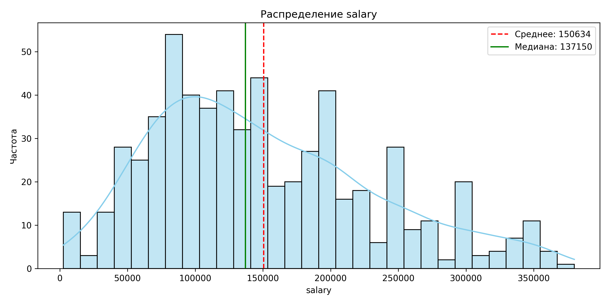
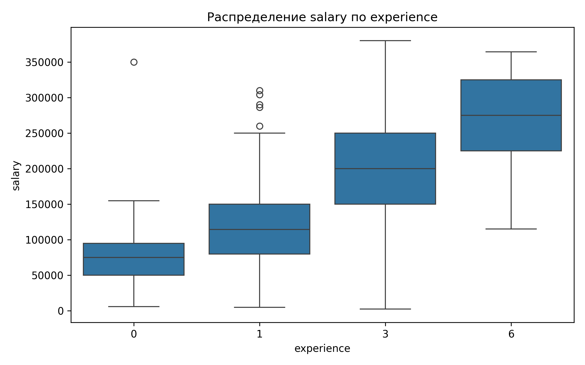
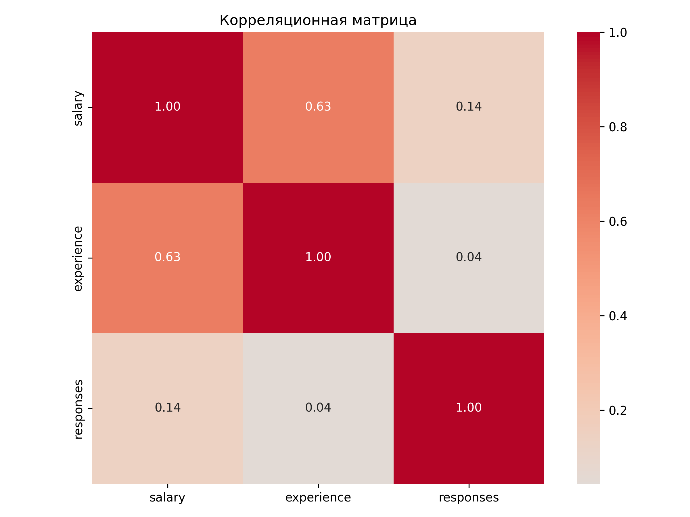
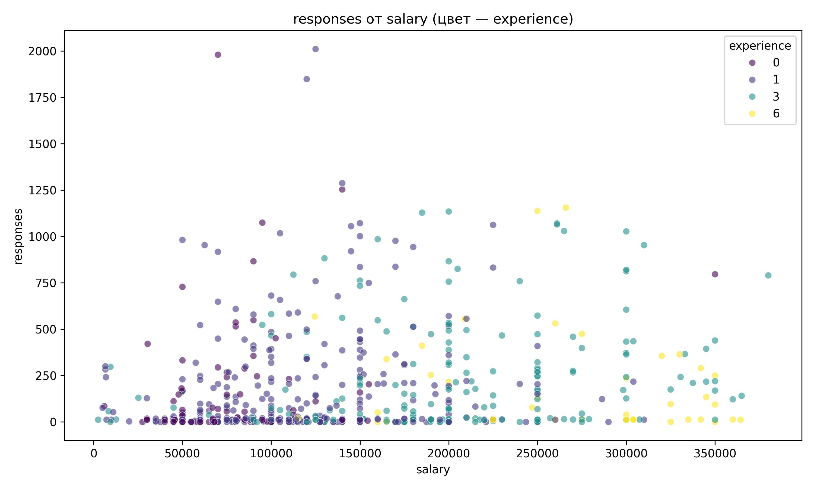

# Анализатор вакансий с HeadHunter

Этот проект предназначен для сбора, анализа и визуализации данных о вакансиях с сайта [HeadHunter (hh.ru)](https://hh.ru/). Он позволяет получить представление о рынке труда по заданной специальности, выявить зависимости между зарплатой, опытом и другими параметрами.

## Ключевые выводы по данным

В ходе выполнения лабораторной работы был проведён полный цикл первичного анализа данных о вакансиях Python-разработчиков: от загрузки и очистки до расчёта описательных статистик и построения визуализаций. Полученные результаты позволяют сделать ряд обобщений о структуре и закономерностях исследуемого датасета.

Распределение заработных плат характеризуется правосторонней асимметрией – среднее значение превышает медиану, а мода смещена влево. Это говорит о том, что основная масса вакансий предлагает зарплаты ниже среднего уровня. Анализ связи опыта и зарплаты подтвердил умеренную положительную корреляцию: с увеличением требуемого опыта растёт и уровень дохода. Наиболее интересным оказался разброс зарплат внутри групп: минимальная вариативность наблюдается у начинающих специалистов и у профессионалов с опытом более шести лет, тогда как в интервалах 1–3 года и 3–6 лет разброс максимален, что свидетельствует о высокой неопределённости в оценке компетенций специалистов среднего уровня. Количество откликов на вакансии, вопреки ожиданиям, практически не связано ни с зарплатой, ни с опытом – коэффициенты корреляции близки к нулю. Это указывает на то, что популярность вакансии определяется иными факторами, не учтёнными в данной выборке, такими как требования к навыкам, условия труда или репутация компании.

## Визуализация данных

Визуализации помогают наглядно представить полученные результаты.

### Распределение заработной платы
Гистограмма показывает, что большинство предложений по зарплате сгруппировано в левой части графика, с длинным "хвостом" в сторону высоких зарплат.



### Зависимость зарплаты от опыта
Ящик с усами демонстрирует, как меняется уровень и разброс зарплат с увеличением требуемого опыта.



### Корреляционная матрица
Тепловая карта показывает силу связи между числовыми параметрами. Зеленый цвет означает положительную корреляцию, красный — отрицательную.



### Связь между зарплатой и откликами
Диаграмма рассеяния показывает отсутствие явной зависимости между количеством откликов и предлагаемой зарплатой.



## Структура проекта

-   `main.py`: Главный файл для запуска анализа данных из `vacancies.csv`.
-   `parser.py`: Скрипт для сбора данных о вакансиях с hh.ru.
-   `statictic.py`: Модуль для проведения статистического анализа и создания визуализаций.
-   `pyproject.toml`: Файл с зависимостями проекта для `poetry`.
-   `data/`: Папка для хранения данных (например, `vacancies.csv`).
-   `img/`: Папка для сохранения сгенерированных изображений.

## Установка

Для работы с проектом рекомендуется использовать менеджер зависимостей [Poetry](https://python-poetry.org/).

1.  **Клонируйте репозиторий:**
    ```bash
    git clone <URL-вашего-репозитория>
    cd <имя-папки>
    ```

2.  **Установите зависимости:**
    Убедитесь, что у вас установлен Poetry. Затем выполните команду:
    ```bash
    poetry install
    ```
    Это создаст виртуальное окружение и установит все необходимые пакеты, указанные в `pyproject.toml`.

## Использование

### 1. Сбор данных (Парсинг)

Чтобы собрать свежие данные, необходимо запустить `parser.py`. Вы можете изменить поисковый запрос и количество вакансий для сбора.

Для этого раскомментируйте и измените соответствующие строки в `main.py`:
```python
# parser = Parser("Python", mx=3000) # Замените "Python" на нужный запрос
# df = parser.run()
# parser.write_csv(df)
```
Или выполните код напрямую в интерактивной среде Python:
```python
from parser import Parser

# Создаем экземпляр парсера для запроса "Java" на 1000 вакансий
parser = Parser("Java", mx=1000) 
df = parser.run()
```
Результат будет сохранен в файл, например, `Java.csv`. Для дальнейшего анализа переименуйте его в `vacancies.csv` и поместите в папку `data`.

### 2. Анализ и визуализация

Для запуска анализа данных, которые уже находятся в `data/vacancies.csv`, просто выполните `main.py`.

```bash
poetry run python main.py
```

Скрипт выведет в консоль основную информацию о датасете, а в папке `img/` будут сохранены обновленные графики.
