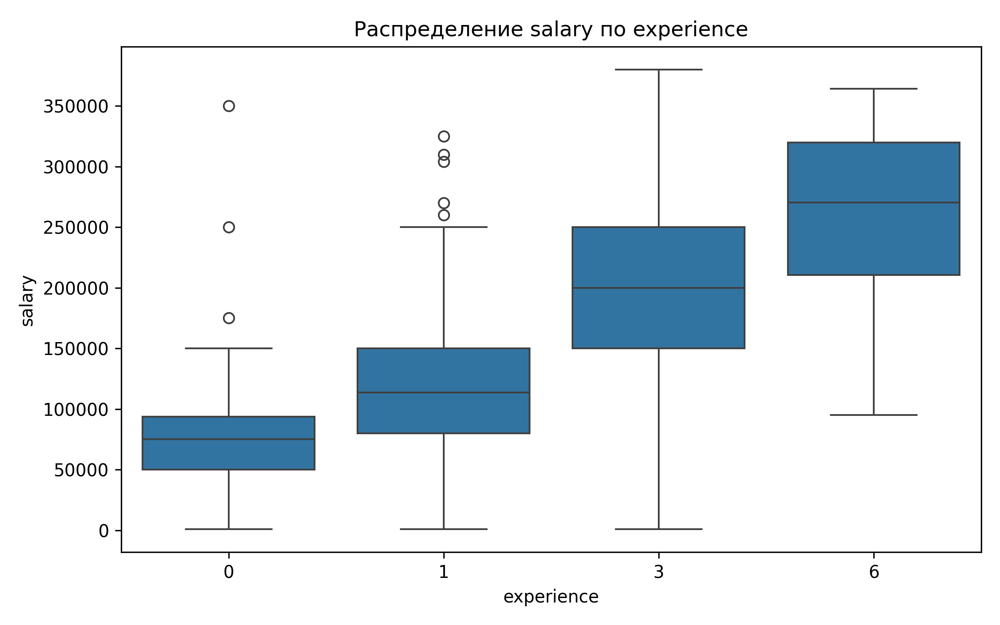
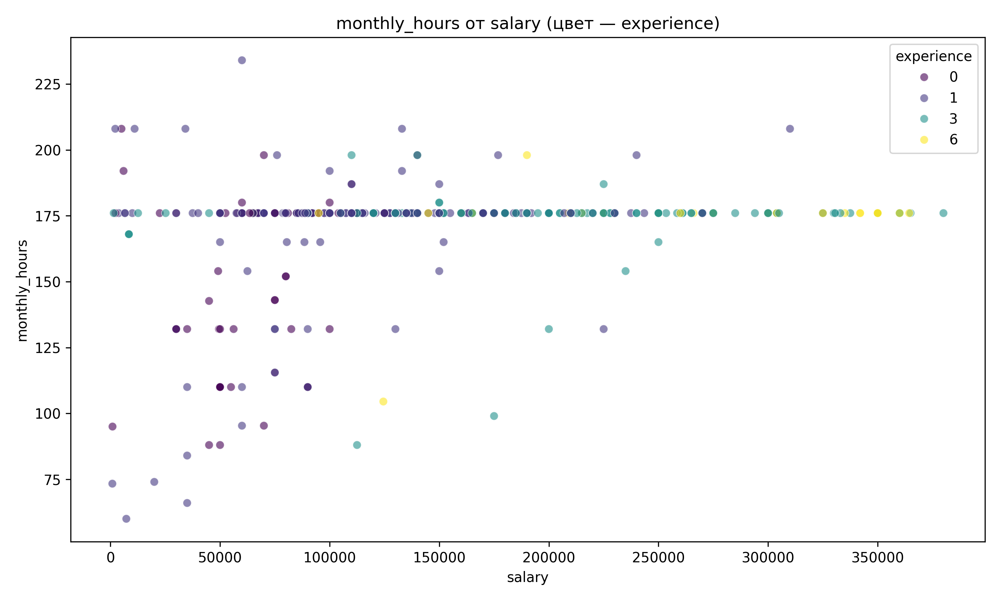

# Анализатор вакансий с HeadHunter

Этот проект предназначен для сбора, анализа и визуализации данных о вакансиях с сайта [HeadHunter (hh.ru)](https://hh.ru/). Он позволяет получить представление о рынке труда по заданной специальности, выявить зависимости между зарплатой, опытом и другими параметрами.

В проекте реализовано два парсера:
1.  **HTML-парсер:** Собирает данные напрямую со страниц поиска вакансий.
2.  **API-парсер:** Использует официальное API HeadHunter для получения более структурированных данных.

## Ключевые выводы по данным

В ходе выполнения лабораторной работы был проведён полный цикл первичного анализа данных о вакансиях Python-разработчиков: от загрузки и очистки до расчёта описательных статистик и построения визуализаций. Полученные результаты позволяют сделать ряд обобщений о структуре и закономерностях исследуемого датасета.

Распределение заработных плат характеризуется правосторонней асимметрией – среднее значение превышает медиану, а мода смещена влево. Это говорит о том, что основная масса вакансий предлагает зарплаты ниже среднего уровня. Анализ связи опыта и зарплаты подтвердил умеренную положительную корреляцию: с увеличением требуемого опыта растёт и уровень дохода. Наиболее интересным оказался разброс зарплат внутри групп: минимальная вариативность наблюдается у начинающих специалистов и у профессионалов с опытом более шести лет, тогда как в интервалах 1–3 года и 3–6 лет разброс максимален, что свидетельствует о высокой неопределённости в оценке компетенций специалистов среднего уровня. Количество откликов на вакансии, вопреки ожиданиям, практически не связано ни с зарплатой, ни с опытом – коэффициенты корреляции близки к нулю. Это указывает на то, что популярность вакансии определяется иными факторами, не учтёнными в данной выборке, такими как требования к навыкам, условия труда или репутация компании.

## Визуализация данных (API Парсер)

Визуализации помогают наглядно представить полученные результаты. В данном разделе представлены графики, полученные на основе данных из API.

### Распределение заработной платы
Гистограмма показывает, что большинство предложений по зарплате сгруппировано в левой части графика, с длинным "хвостом" в сторону высоких зарплат.


### Зависимость зарплаты от опыта
Ящик с усами демонстрирует, как меняется уровень и разброс зарплат с увеличением требуемого опыта.



### Корреляционная матрица
Тепловая карта показывает силу связи между числовыми параметрами. Зеленый цвет означает положительную корреляцию, красный — отрицательную.


### Связь между зарплатой и часами работы
Диаграмма рассеяния показывает зависимость между месячным окладом и количеством рабочих часов.



## Структура проекта

Проект имеет следующую структуру:

```
.
├── data/              # Папка для хранения данных (CSV файлы)
├── img/               # Папка для сохранения сгенерированных изображений
├── src/
│   └── hh_parser/
│       ├── __init__.py
│       ├── main.py        # Главный файл для запуска анализа
│       ├── config.py      # Конфигурация (токены, ключи API)
│       ├── stats.py       # Модуль для статистики и визуализации
│       └── parsers/
│           ├── __init__.py
│           ├── api_parser.py  # Парсер, использующий API hh.ru
│           └── html_parser.py # Парсер, использующий HTML-разметку
├── tests/             # Папка для тестов
├── .gitignore
├── poetry.lock
├── pyproject.toml     # Файл с зависимостями для Poetry
└── README.md
```

## Установка

Для работы с проектом рекомендуется использовать менеджер зависимостей [Poetry](https://python-poetry.org/).

1.  **Клонируйте репозиторий:**
    ```bash
    git clone <URL-вашего-репозитория>
    cd <имя-папки>
    ```

2.  **Настройте переменные окружения:**
    Создайте файл `.env` в корне проекта и добавьте в него свои данные для работы с API:
    ```
    TOKEN_HH="Ваш_токен_для_API_hh.ru"
    NAME_APP="Название_вашего_приложения"
    EMAIL="Ваш_email@example.com"
    ```

3.  **Установите зависимости:**
    Убедитесь, что у вас установлен Poetry. Затем выполните команду:
    ```bash
    poetry install
    ```
    Это создаст виртуальное окружение и установит все необходимые пакеты.

## Использование

### 1. Сбор данных (Парсинг)

Вы можете использовать один из двух парсеров для сбора данных.

**HTML-парсер:**
Чтобы собрать данные, раскомментируйте и измените соответствующие строки в `src/hh_parser/main.py`:
```python
# from .parsers.html_parser import Parser
# parser = Parser("Python", mx=3000) # Замените "Python" на нужный запрос
# df = parser.run()
```
Результат будет сохранен в файл, например, `Python.csv`.

**API-парсер:**
Для использования API-парсера раскомментируйте следующие строки в `src/hh_parser/main.py`:
```python
# from .parsers.api_parser import HHParserApi
# parser = HHParserApi("Python") # Замените "Python" на нужный запрос
# df = parser.run()
```

### 2. Анализ и визуализация

Для запуска анализа данных, которые уже находятся в одном из `.csv` файлов, укажите имя файла в `src/hh_parser/main.py`:
```python
df = pd.read_csv("data/api/Python.csv", sep=';', encoding='utf-8-sig')
```

Запустите главный модуль из корня проекта:
```bash
poetry run python -m src.hh_parser.main
```

Скрипт выведет в консоль основную информацию о датасете, а в папке `img/` будут сохранены обновленные графики.
